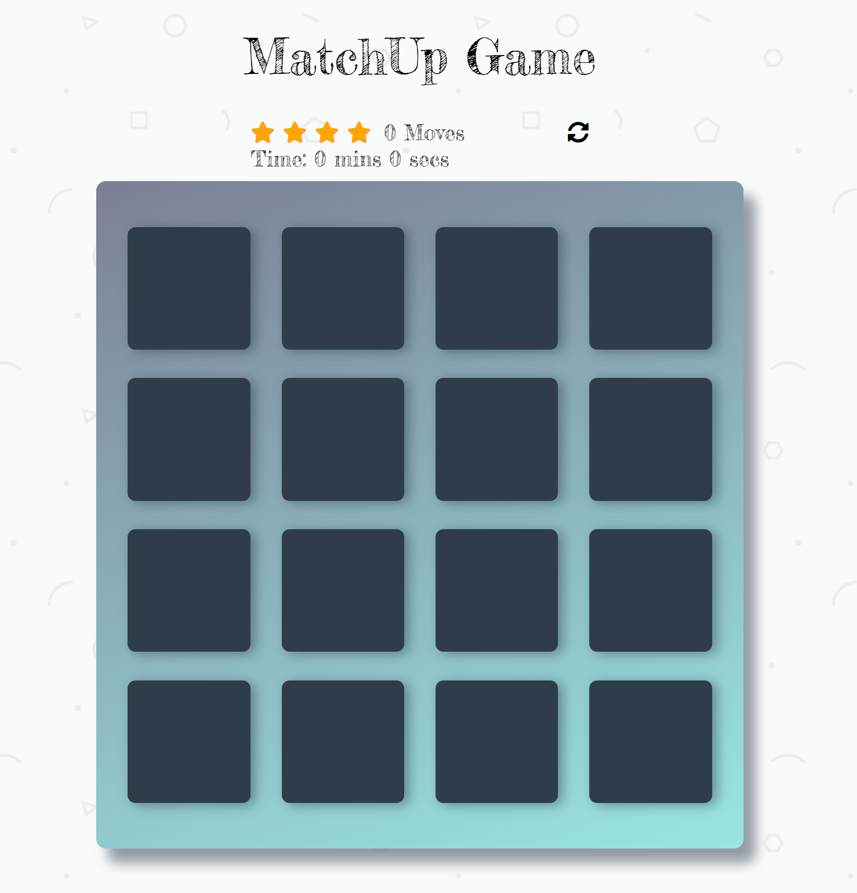

# Match Up Game Project

## What is the Memory Game
MatchUp is a card game.

## Challenge
Match cards with less moves.

## How to Play
Cards are laid out in a grid face down, and players take turns flipping pairs of cards over. If the two cards match, both cards are turned up. If they do not match, the cards are turned back over. The game ends when the last pair has been picked up. 

## Instructions
* Click on a card.
* Player chooses two cards and turns them face up.
* If they are of the same rank then the player keep up the cards faced up.
* If they are not of the same rank, they are turned face down again.
* Match cards properly with less moves and in faster time
